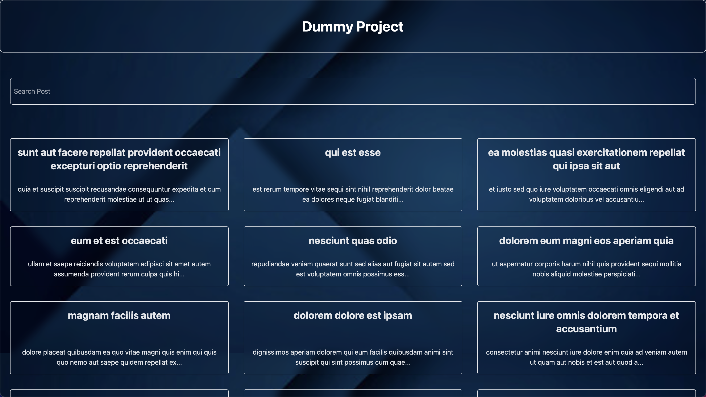
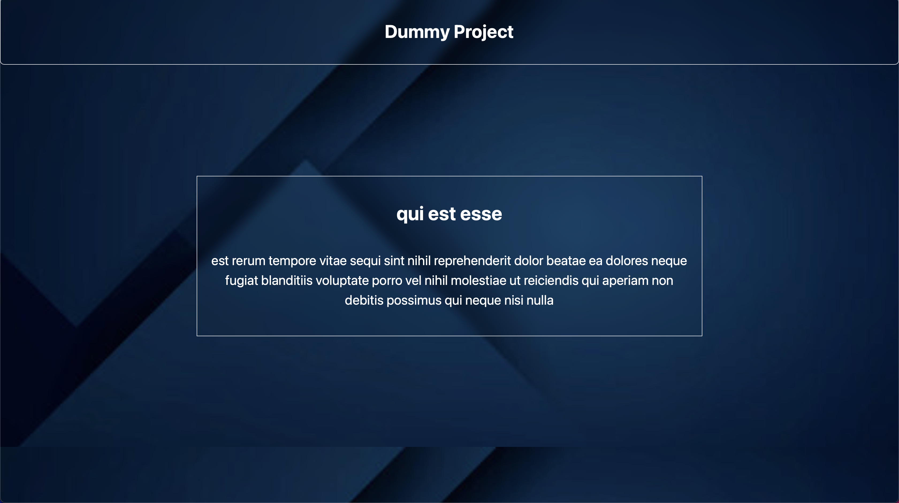

# Dummy Project

## A simple React.js application that fetches and displays data from a public API with search and filtering functionality.

## Features:

- Fetches data from JSONPlaceholder API
- Uses React Router for navigation
- Search and filter functionality
- Context API for state management
- Tailwind CSS for modern styling
- Responsive Navbar with a hamburger menu

## Home Page

## Detail Page

## Tech Stack

- Frontend: React.js, Tailwind CSS
- State Management: Context API
- Routing: React Router DOM
- API handling: Axios

## Instalallation & Setup

1.  Clone the Repository
2.  Install Dependencies with "npm insall"
3.  Run this project with "npm run dev"

## Usage

- Home page (/): Displays a list of posts with a search bar
- Details Page (/item/:id): Shows details of a selected post
- Navbar: Includes a Project tile for returning to home page

## API used

This project uses JSONPlaceholder API for fetching posts:
🔗 https://jsonplaceholder.typicode.com/posts

## Contribution

Since this is an example project, Feel free to clone and rename this project to use for your own purpose.

## License

This project is open-source and available under the MIT License.
